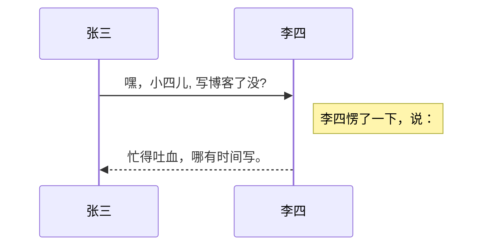

# axios-vue

## Project setup
```
npm install
```

### Compiles and hot-reloads for development
```
npm run serve
```

### Compiles and minifies for production
```
npm run build
```

### Lints and fixes files
```
npm run lint
```

### Customize configuration
https://github.com - 自动生成！
[GitHub](https://github.com)


Format: 


| Tables        | Are           | Cool  |
| ------------- |:-------------:| -----:|
| col 3 is      | right-aligned | $1600 |
| col 2 is      | centered      |   $12 |
————————————————



```
axios请求方法：get,post,put,patch,delete
    get：获取数据
    post：提交数据（表单提交+文件上传）
    put：更新数据（所有数据推送到后端）
    patch：更新数据（只将修改的数据推送到后端）
    delete：删除数据
```
```javascript {.line-numbers}
            // axios({
            //     method:'post',
            //     url: requestUrl,
            //     data: {
            //         id:requestUrl
            //     }
            // }).then(res=>{

            // })
            axios.get("/data.json",{
                params:{
                    id:12
                }
            })
            .then(res => {
                console.log(res)
            })
            .catch(err => {
                console.error(err); 
            })  
```
